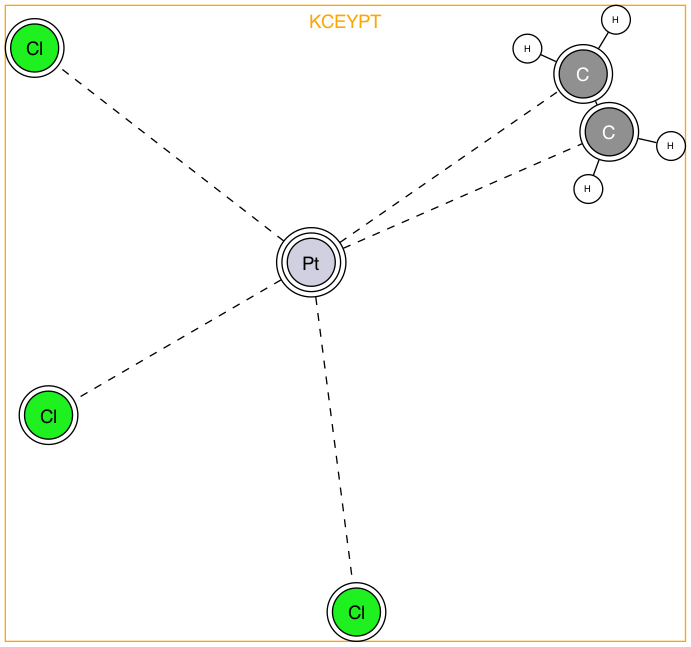

# tmqmrdfdata

`tmqmrdfdata` is an [rdflib](https://pypi.org/project/rdflib/)-based Python package designed to support and facilitate the interaction with _[tmQM-RDF](https://github.com/luca-cibinel/tmQM-RDF): a Knowledge Graph Representing Transition Metal Complexes_.
Amongst its main functionalities, the package allows to:
  - easily download the data from the dedicated GitHub repository;
  - access specific subgraphs;
  - retrieve the available quantitative and qualitative properties in a Python-friendly format.

## Installation
The package may be installed using `pip`:
```bash
pip install tmqmrdfdata
```

## Documentation
The documentation of the package is available at [https://github.com/luca-cibinel/tmqmrdfdata/tree/main/docs](https://github.com/luca-cibinel/tmqmrdfdata/tree/main/docs).

## Getting started

### Downloading the knowledge graph

To download the tmQM-RDF knowledge graph, use the following code:
```python
from tmqmrdfdata import download_tmQM_RDF_knowledge_graph

download_tmQM_RDF_knowledge_graph(
  dir = "data/",
  version = "latest"
)
```
This will download the latest available version of tmQM-RDF into the directory `data/`. Supposing that the latest version is version 1.0, the finaly directory tree will look like this:
```bash
data/
└── tmQM-RDF-v1.0
    ├── assertions/
    │   └── ...
    └── terminology/
        └──  ...
```
It is possible to download a specific version of tmQM-RDF by changing the `version` parameter. This parameter takes in input a string representing the _exact_ version number to retrieve (without any leading prefix, e.g., to download the version v1.0.1, you must type `version = "1.0.1"`).

### Interfacing with the data
Once the data has been downloaded, the main interface can be instantiated:
```python
from tmqmrdfdata import TmqmRDF

interface = TmqmRDF("data/")
```
This will initialise a dictionary-like object that can retrieve information from the knowledge graph. Upon instantiation, only the _terminology component_ (or _TBox_) is immediately available, whereas any part of the _assertion component_ (or _ABox_) will have to be explicitly retrieved first.

### Accessing the TBox
The TBox contains the definition of all the terms used in the knowledge graphs. A wrapper of this part of the knowledge graph is available in the attribute `interface.tbox`. See the [related documentation](https://github.com/luca-cibinel/tmqmrdfdata/tree/main/docs).

### Accessing the ABox
Subgraphs regarding assertions on specific TMCs, ligand species, metal centres, or chemical element are retrieved using the method `interface.fetch`:
```
interface.fetch(tmcs = ["KCEYPT", "ABEVAH"], ligands = ["ligand1-0"])
```
Now the interface has access to the subgraphs related to the TMCs _KCEYPT_ and _ABEVAH_ and the ligand species _ligand1-0_ (according to the indexes used in [tmQMg-L](https://github.com/uiocompcat/tmQMg-L)).
These can be now accessed explicitly as follows:
```python
kceypt = interface["TMC", "KCEYPT"]
lig1_0 = interface["ligand", "ligand1-0"]
```
Both `kceypt` and `lig1-0` are instances of (subclasses) of `tmqmrdfdata.assertions.TmqmRDFABoxSubgraph`. Metal centres and elements can be accessed with the notation `interface["centre", ...]` and `interface["element", ...]` respectively.

Retrieval and access can be performed more conveniently using the methods `.tmc`, `.ligand`, `.centre`, or `.element`. For instance, the code
```python
kceypt = interface.tmc("KCEYPT")
lig1_0 = interface.ligand("ligand1-0")
```
is equivalent to
```python
interface.fetch(tmcs = ["KCEYPT"], ligands = ["ligand1-0"])
kceypt = interface["TMC", "KCEYPT"]
lig1_0 = interface["ligand", "ligand1-0"]
```

### Property retrieval
Wihtin tmQM-RDF, atoms, atomic bonds, ligand species, and whole complexes are endowed with properties. These can be accessed from the corresponding TMC/ligand species subgraph. For example, if you wish to retrieve the natural atomic charge of the atoms of KCEYPT you can use the following code:
```python
from tmqmrdfdata.terminology import tmAp

atoms_w_charge = kceypt.atoms(data = tmAp["natural_atomic_charge"])
```
Notice that the property had to be specified using `tmAp["natural_atomic_charge"]`. Let's break this symbol down:
- `tmAp`: this is a variable introduced in the module `tmqmrdfdata.terminology`. It is an [rdflib.Namespace](https://rdflib.readthedocs.io/en/stable/apidocs/rdflib.namespace/) encoding the namespace `<https://www.integreat.no/research/rdf/tmqm-rdf-dataset/#/atomic/atom/property/>`.
- `tmAp["natural_atomic_charge"]` produces the URI `<https://www.integreat.no/research/rdf/tmqm-rdf-dataset/#/atomic/atom/property/natural_atomic_charge>`, which is the URI that tmQM-RDF uses to denote the natural atomic charge property of atoms.

If you now want to inspect the result, you will have to go through a dictionary where the keys are the URIs of the atoms of KCEYPT whereas the values are [collections.namedtuple](https://docs.python.org/3/library/collections.html#collections.namedtuple) objects mirroring the structure of the RDF graph describing the property. See the [related documentation](https://github.com/luca-cibinel/tmqmrdfdata/tree/main/docs) for information on how this mirroring is constructed.
For now, let's just inspect the first entry of this dictionary:
```python
atom, atom_data = next(iter(atoms_w_charge.items()))

print(atom)
# >>> https://www.integreat.no/research/rdf/tmqm-rdf-dataset/#/atomic/atom/KCEYPT_Pt_0
print(atom_data.natural_atomic_charge.value)
# >>> 0.73094
```

Notice that, regardless of whether and which properties you request, `atom_data` will always have the `symbol` attribute, containing the chemical symbol of the atom:
```python
print(atom_data.symbol)
# >>> https://www.integreat.no/research/rdf/tmqm-rdf-dataset/#/atomic/atom/reference/Pt
```

### Advanced querying
If you need to perform more advanced queries, you can always rely on [rdflib](https://pypi.org/project/rdflib/)'s own machinery. You can access the rdflib's representation of the RDF graph via the attribute `.kgraph` of `tmqmrdfdata.assertions.TmqmRDFABoxSubgraph`.

### Visualising TMCs
TMC-related subgraph posses a unique method, that allows to visualise their moelcular structure using [graphviz](https://graphviz.readthedocs.io/en/stable/):
```python
kceypt.view()
```


## Contact
For any questions related to the package, contact Luca Cibinel: [https://orcid.org/0009-0009-1274-8327](https://orcid.org/0009-0009-1274-8327).

For questions regarding tmQM-RDF, please check the [tmQM-RDF contact info](https://www.integreat.no/research/rdf/tmqm-rdf-dataset/).
