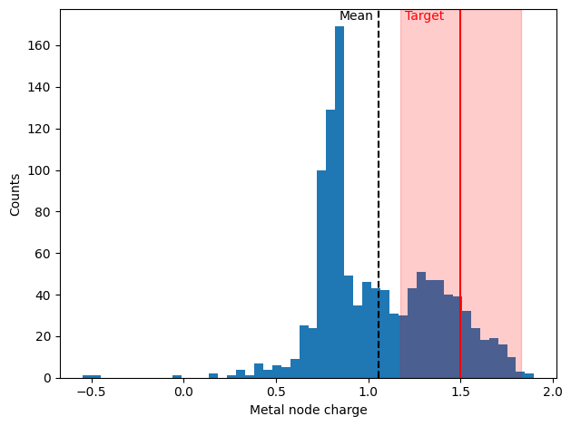

Example: fetching zirconium complexes with haptic ligands
=========================================================

In this example we will consider the following query:

    Fetch zirconium complexes with one or more hepta^5 ligands.
    Afterwards, restrict the selection to those complexes which also have a metal node charge close to +1.5e.

We will solve this task by means of the function :meth:`tmqmrdfdata.concurrent_map`.
Similarly to the usual ``map`` function, :meth:`tmqmrdfdata.concurrent_map` will execute a user-specified function using entries coming from tmQM-RDF as arguments.

Formalising the Query
---------------------

First of all, it is necessary to codify the query above in the form a function compatible with :meth:`tmqmrdfdata.concurrent_map`. Such a function
is required to accept two positional arguments and one keyword argument:

    - an instance of :class:`tmqmrdfdata.TmqmRDF` (named ``tmqmrdf`` below);
    - a list of datapoints on which to run the job (named ``tmcs`` below,in this case we will operate on complexes);
    - ``context``, a dictionary containing optional data, ignored during this tutorial, as it will not be necessary.

The main purpose of :meth:`tmqmrdfdata.concurrent_map` is to efficiently dispatch datapoints from tmQM-RDF in order to prevent excessive computational and/or memory costs.
This logic is masked behind the ``tmcs`` argument described above. At runtime, it will evaluate to an appropriate batch of CSD codes on which our function will need to operate.
From our perspective, we do not need to concern ourselves with the specifics of data partitioning. We can focus directly on implementing the desired query on the set of TMCs :meth:`tmqmrdfdata.concurrent_map` will provide.

Fetching the Data
^^^^^^^^^^^^^^^^^

The first step is to extract the actual data from tmQM-RDF. What we receive as input is only a list of references, namely the CSD codes. These are enough to
locate the corresponding TMCs, so we can simply proceed with a call to :meth:`tmqmrdfdata.TmqmRDF.fetch`:

.. code-block:: python

    tmqmrdf.fetch(tmcs = tmcs, auto_fetch_tmc_components = True, progress = False)

Remember that ``tmcs`` is a set of CSD codes and that ``tmqmrdf`` is an instance of :class:`tmqmrdfdata.TmqmRDF`. We set ``auto_fetch_tmc_components = True`` because
the query needs information about the ligand species as well (i.e., the hapticity orders), which are not acessible from the TMC instances alone.

Matching TMCs Against the Query
^^^^^^^^^^^^^^^^^^^^^^^^^^^^^^^

Now that the data is accessible, we can verify if each TMCs adheres to the specifics provided by the query.
We can easily iterate over the pairs ``(symbol, tmc)`` by calling :meth:`tmqmrdfdata.TmqmRDF.items` with the ``"TMCs"`` parameter.
By doing so, ``symbol`` will be a string containing the CSD code while ``tmc`` will be an instance of :class:`tmqmrdfdata.assertions.TMC`.

For each pair, we need to check if the metal centre is Zirconium (Zr) and if there is at least one ligand with hapticity order :math:`\eta^5`.

The first condition is easy to verify:

.. code-block:: python

    tmc.centre()[1].symbol == "Zr"

The method :meth:`tmqmrdfdata.assertions.TMC.centre` returns a pair ``(metal_centre_uri, metal_centre_object)``, where, in particular, 
``metal_centre_object`` is an object whose ``symbol`` attribute is a string containing the chemical symbol of the metal centre.

To check for the existance of an :math:`\eta^5` ligand, we can use the :meth:`tmqmrdfdata.assertions.TMC.ligands` method to iterate over the ligand
_instances_ that compose the TMC. The default output of the method is a dictionary whose values are objects summarising the ligand _instances_.
Being instances, these objects do not contain any generic information on the ligand species themselves, thus we need to fall back to the ligand species data
in tmQM-RDF. The key needed to access this type of data from `tmqmrdf`, the :class:`tmqmrdfdata.TmqmRDF` instance, is the pair ``("ligand", ligand_species_symbol)``.
The latter can be extracted from the object representing a ligand instance via the ``symbol`` attribute, similarly to what happened for the metal centre.
So far, we have then built the following scaffold for our query:

.. code-block:: python

    for ligand in tmc.ligands().values():
        ligand_species = tmqmrdf["ligand", ligand.symbol]

        ...

As explained in :doc:`/usage/property_retrieval`, to check the hapticity order of the ligand, via the ``lgLrp:n_haptic_bound`` property, we can use the following code:

.. code-block:: python

    ligand_species.species(
            data = tmqmrdf.tbox.lgLrp.n_haptic_bound
        ).n_haptic_bound.value >= 5

Extracting the Metal Charge for Downstream Filtering
^^^^^^^^^^^^^^^^^^^^^^^^^^^^^^^^^^^^^^^^^^^^^^^^^^^^

Altough the first part of the query only asks about Zirconium and an hepta^5 ligand, the second half asks to further filter TMCs based on the metal charge.
The actual filter can be best implemented outside of the :meth:`tmqmrdfdata.concurrent_map` job, but it is convenient to already extract the information needed, namely, the metal charge (``cmTp:metal_node_natural_charge``):

.. code-block:: python

    charge = tmc.complex(
            data = tmqmrdf.tbox.cmTp.metal_node_natural_charge
        )[1].metal_node_natural_charge.value

Assembling the Query
^^^^^^^^^^^^^^^^^^^^

Summarising the steps described above, the full function to be passed to :meth:`tmqmrdfdata.concurrent_map` reads as follows:

.. code-block:: python

    def job_fetch_Zn_hepta5(tmqmrdf, tmcs, context = None):
        partial_result = []

        tmqmrdf.fetch(tmcs = tmcs, auto_fetch_tmc_components = True, progress = False)
        
        for symbol, tmc in tmqmrdf.items("TMCs"):
            if tmc.centre()[1].symbol == "Zr":
                hit_hepta5 = False
                for ligand in tmc.ligands().values():
                    _, ligand_species = tmqmrdf["ligand", ligand.symbol].species(
                        data = tmqmrdf.tbox.lgLrp.n_haptic_bound
                    )

                    if ligand_species.n_haptic_bound.value >= 5:
                        hit_hepta5 = True
                        break
                
                if hit_hepta5:
                    charge = tmc.complex(
                            data = tmqmrdf.tbox.cmTp.metal_node_natural_charge
                        )[1].metal_node_natural_charge.value
                    partial_result.append((symbol, charge))

        return partial_result

Running the Query
-----------------

We are now ready to run the query and process the results. When we run :meth:`tmqmrdfdata.concurrent_map`, we will obtain a result roughly equivalent to

.. code-block:: python

    results = [job_fetch_Zn_hepta5(tmqmrdf, tmcs_batch) for tmcs_batch in batches]

where ``tmqmrdf`` and ``batches`` are internally handled by :meth:`tmqmrdfdata.concurrent_map`. All we have to do, as users, is to provide the function with
the path to the data (here we will assume it to be ``"./temp/hdt-tmQM-RDF-v1.0.1/"``), the query function, the population of target tmQM-RDF entries, and an optional number of workers for parallel computing.
The target TMCs can be specified either as a list of CSD codes or, as we will do here, as the ``"TMCs"`` literal, which will automatically target all TMCs in tmQM-RDF.
Finally, we aggregate all the partial results into a single list for practicality. Overall, the code will look like this:

.. code-block:: python

    hits = tmrdf.concurrent_map(
            "./temp/hdt-tmQM-RDF-v1.0.1/", 
            job_fetch_Zn_hepta5,
            target = "TMCs",
            n_workers = 2
        )
    aggregated = functools.reduce(lambda x, y : x + y, hits)

.. note::

    This code takes approximately 10 minutes to run on a standard laptop.

Now all the admissible complexes are listed, as ``(CSD_code, metal_node_charge)`` pairs, in the ``aggregated`` field. For example, we can check a handful
of results:

.. code-block:: python

    print("First 10 hits:")
    for line in aggregated[:10]:
        print(f"\tCSD code: {line[0]}; Metal charge: {line[1]:.4f} e")

    # Output:
    #
    # First 10 hits:
	#    CSD code: WUWHUR; Metal charge: 1.3930 e
	#    CSD code: ZIMXUO; Metal charge: 1.5250 e
	#    CSD code: JAYMAX; Metal charge: 0.5797 e
	#    CSD code: NETYOA; Metal charge: 1.2848 e
	#    CSD code: LISPUY; Metal charge: 1.1515 e
	#    CSD code: SIXPAQ; Metal charge: 1.3676 e
	#    CSD code: VAKGOD; Metal charge: 0.4219 e
	#    CSD code: XEJMEE; Metal charge: 0.6400 e
	#    CSD code: SIBMAS; Metal charge: 0.7543 e
	#    CSD code: YALZOB; Metal charge: 0.7371 e

Filtering for Metal Charge
^^^^^^^^^^^^^^^^^^^^^^^^^^

For the second part of this exercise, we need to restrict our set of results to only those complexes whose metal node charge is "close" to +1.5e.
Here we will interpret "close" as: "within 1 standard deviation of +1.5e".

.. code-block:: python
    
    import numpy as np

    charge = np.array([line[1] for line in aggregated])
    sd = np.std(charge)

    selected_hits = [
        line for line in aggregated
        if line[1] >= 1.5 - sd and line[1] <= 1.5 + sd
    ]

    print("First 10 hits with charge ~= +1.5e:")
    for line in selected_hits[:10]:
        print(f"\tCSD code: {line[0]}; Metal charge: {line[1]:.4f} e")

    # Output:
    #
    # First 10 hits with charge ~= +1.5e:
    #	 CSD code: WUWHUR; Metal charge: 1.3930 e
    #    CSD code: ZIMXUO; Metal charge: 1.5250 e
    #    CSD code: NETYOA; Metal charge: 1.2848 e
    #    CSD code: SIXPAQ; Metal charge: 1.3676 e
    #    CSD code: GAZPAB; Metal charge: 1.4099 e
    #    CSD code: CAHLAY; Metal charge: 1.3573 e
    #    CSD code: XIFQAE; Metal charge: 1.4951 e
    #    CSD code: ECIMAF; Metal charge: 1.2825 e
    #    CSD code: VIZWEG; Metal charge: 1.4191 e
    #    CSD code: HINNIB; Metal charge: 1.3903 e

As a reference, we include here the histogram of the observed metal charges for the entire result set of the first part of the query. We also highlight the
mean metal charge (black dashed vertical line) and the target region for the second part of the query (red shaded area).

.. _`rdf:type`: http://www.w3.org/1999/02/22-rdf-syntax-ns#
.. _SPARQL: https://www.w3.org/TR/2013/REC-sparql11-query-20130321/

Full Code
---------

.. code-block:: python

    import functools
    import os

    import matplotlib.pyplot as plt
    import numpy as np

    import tmqmrdfdata as tmrdf

    def job_fetch_Zi_hepta5(tmqmrdf, tmcs, context = None):
        partial_result = []

        tmqmrdf.fetch(tmcs = tmcs, auto_fetch_tmc_components = True, progress = False)
        
        for symbol, tmc in tmqmrdf.items("TMCs"):
            if tmc.centre()[1].symbol == "Zr":
                hit_hepta5 = False
                for ligand in tmc.ligands().values():
                    _, ligand_species = tmqmrdf["ligand", ligand.symbol].species(
                        data = tmqmrdf.tbox.lgLrp.n_haptic_bound
                    )

                    if ligand_species.n_haptic_bound.value >= 5:
                        hit_hepta5 = True
                        break
                
                if hit_hepta5:
                    charge = tmc.complex(
                            data = tmqmrdf.tbox.cmTp.metal_node_natural_charge
                        )[1].metal_node_natural_charge.value
                    partial_result.append((symbol, charge))

        return partial_result

    if __name__ == "__main__":
        __spec__ = None
        
        # 1. Download data and initialise interface
        # =========================================
        if not os.path.exists("./temp/hdt-tmQM-RDF-v1.0.1"):
            if not os.path.exists("./temp"):
                os.makedirs("./temp")

            tmrdf.download_tmQM_RDF_knowledge_graph(dir = "./temp", version = "1.0.1", hdt_format = True)
        
        # 2. Extract CSD codes (and metal node charge) of target TMCs
        # =======================================================
        hits = tmrdf.concurrent_map(
            "./temp/hdt-tmQM-RDF-v1.0.1/", 
            job_fetch_Zi_hepta5,
            target = "TMCs",
            n_workers = 2
        )
        aggregated = functools.reduce(lambda x, y : x + y, hits)
        
        # 3. Inspect results
        # ==================
        print("First 10 hits:")
        for line in aggregated[:10]:
            print(f"\tCSD code: {line[0]}; Metal charge: {line[1]:.4f} e")
        print()

        charge = np.array([line[1] for line in aggregated])
        mu, sd = np.mean(charge), np.std(charge)
        print(f"Mean metal charge for hepta 5 / Zr complexes: {mu:.4f} +- {sd:.4f} e")

        # 3.1 select complexes with charge close to +1.5e
        # -----------------------------------------------
        selected_hits = [
            line for line in aggregated
            if line[1] >= 1.5 - sd and line[1] <= 1.5 + sd
        ]

        print()
        print("First 10 hits with charge ~ +1.5e:")
        for line in selected_hits[:10]:
            print(f"\tCSD code: {line[0]}; Metal charge: {line[1]:.4f} e")

        # 3.2 Plot metal charge histogram
        # -------------------------------
        fig, ax = plt.subplots()
        ax.hist(charge, bins = 50)

        ax.set_xlabel("Metal node charge")
        ax.set_ylabel("Counts")

        ax.axvline(x = mu, ls = "dashed", c = "black")
        ax.text(mu*0.8, 0.97, "Mean", color = "black", transform = ax.get_xaxis_transform())

        ax.axvline(x = 1.5, ls = "solid", c = "red")
        ax.text(1.5*0.8, 0.97, "Target", color = "red", transform = ax.get_xaxis_transform())
        ax.fill_betweenx([0, 1], 1.5 - sd, 1.5 + sd, color = (1., 0, 0, 0.2), transform = ax.get_xaxis_transform())

        fig.savefig("./query_Zn_hepta5_metalcharge1.5.png", format = "png", bbox_inches = "tight")